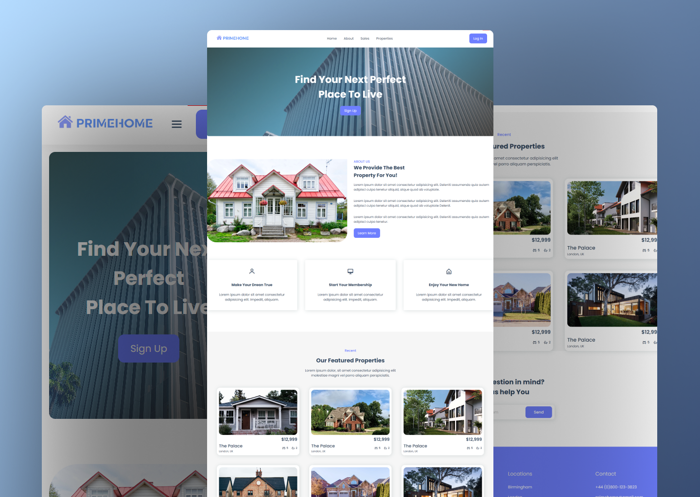

# PrimeHome Real Estate Website

PrimeHome is a responsive real estate website that aims to provide users with a modern and intuitive platform to explore property listings. Built using HTML, CSS, and JavaScript, this website features various sections such as About, Recent Listings, Newsletter, and user authentication pages like Sign Up and Login.

## Preview



## Features

- **Responsive Design:** Ensure an optimal viewing experience across a variety of devices.
- **Multiple Sections:** Explore about the company, view recent property listings, and subscribe to the newsletter.
- **User Authentication:** Sign up for an account or log in to access personalized features.
- **Modern UI Design:** Sleek and visually appealing design for an enhanced user experience.

## Getting Started

To run this website locally, follow these steps:

1. Clone the repository to your local machine:

   ```bash
   git clone https://github.com/Devsethi3/Primehome-Real-Estate.git
   ```

2. Open the `index.html` file in your preferred web browser.

## Sections

### About

Learn about PrimeHome, its mission, and the team behind the scenes.

### Recent Listings

Explore the latest and featured property listings with detailed information.

### Newsletter

Subscribe to the newsletter to receive updates on new listings and real estate trends.

### Sign Up and Login

Create an account or log in to access additional features, save favorites, and manage preferences.

## Customization

Feel free to customize the website to fit your branding or specific requirements. Adjust styles, colors, and content as needed.

## Contributing

If you'd like to contribute to this project, please follow these steps:

1. Fork the repository.
2. Create a new branch for your feature or improvement.
3. Make your changes and commit them with descriptive messages.
4. Push your changes to your forked repository.
5. Open a pull request to merge your changes into the main branch.

Explore the PrimeHome Real Estate Website, provide feedback, and consider contributing to its development. Thank you for checking out the PrimeHome Real Estate repository!